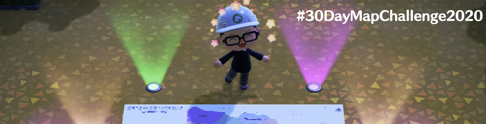

# 30DayMapChallenge2020

Repositorio de mapas del 30DayMapChallenge del 2020

A continuación presento los mapas que presenté en dicho evento. No se pudieron hacer más debido a que se me atravesó un curso, un datatón y mucho trabajo extra 😅. 
Sin embargo, es un trabajo honesto. 

Los mapas en su mayoría presentan el código y son ejemplos reproducibles (en su mayoría). Se pone a su disposición para revisión de aquellos interesados. 

### Día 1. Puntos. 

<blockquote class="twitter-tweet">
Dia 1 del <a href="https://twitter.com/hashtag/30DayMapChallenge?src=hash&amp;ref_src=twsrc%5Etfw">#30DayMapChallenge</a> 2020.<a href="https://twitter.com/hashtag/Puntos?src=hash&amp;ref_src=twsrc%5Etfw">#Puntos</a> por votos.   En este experimento de mapa, traté de representar un punto = un voto de la pasada elección local en Coahuila para cada uno de los tres principales partidos en la Entidad. <a href="https://t.co/lL4EkHyuZV">pic.twitter.com/lL4EkHyuZV</a>
&mdash; Juvenal (@JuvenalCamposF) <a href="https://twitter.com/JuvenalCamposF/status/1323082487950577665?ref_src=twsrc%5Etfw">November 2, 2020</a></blockquote> 

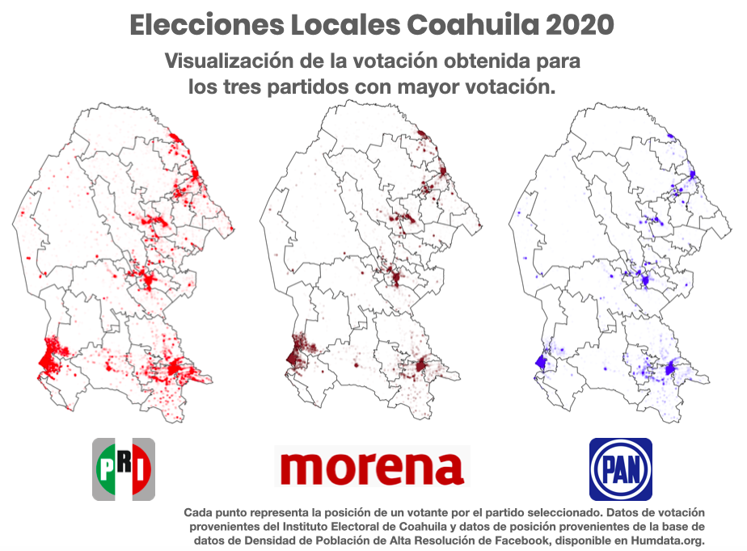

### Día 2. Líneas. 

[Versión interactiva](https://rpubs.com/Juve_Campos/MapaMetro1985)

<blockquote class="twitter-tweet">
Dia 2 del <a href="https://twitter.com/hashtag/30DayMapChallenge?src=hash&amp;ref_src=twsrc%5Etfw">#30DayMapChallenge</a> : Líneas.   Para la elaboración del mapa de la izquierda, digitalicé (en AutoCAD) la imagen de la derecha del Plan Maestro 1985 del Metro, para poder explorar mejor la idea original del desarrollo a futuro de este sistema de transporte: <a href="https://t.co/xS0P3CQHlm">pic.twitter.com/xS0P3CQHlm</a>
&mdash; Juvenal (@JuvenalCamposF) <a href="https://twitter.com/JuvenalCamposF/status/1323516075783327744?ref_src=twsrc%5Etfw">November 3, 2020</a></blockquote>

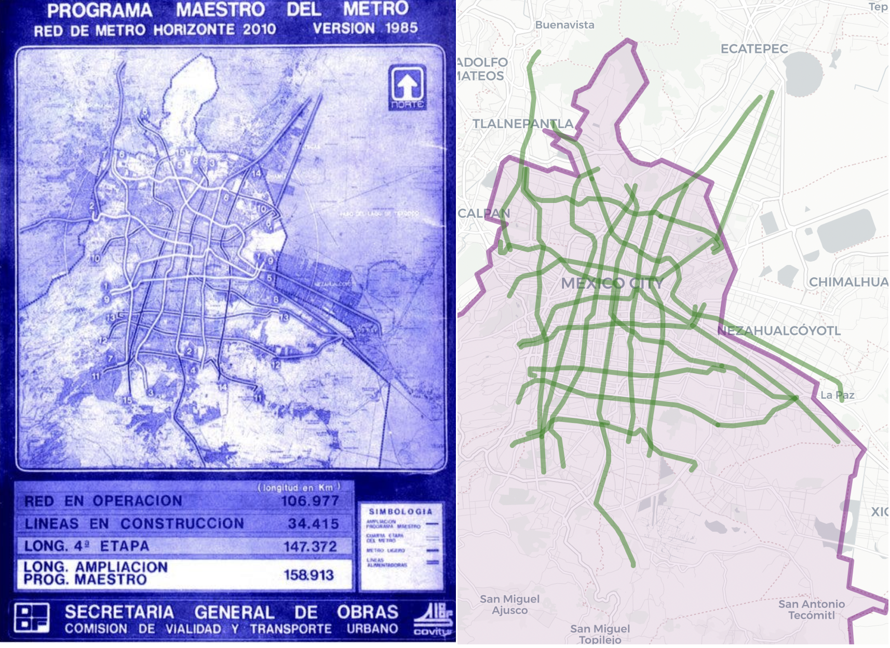

### Día 3. Polígonos. 

Mapa de presidentas municipales en Morelos para cada uno de los municipios a lo largo de la historia registrada del estado. 

El mapa tuvo sus críticas debido a que muchas de las presidentas no fueron elegidas en elecciones, sino que, en gran proporción, entraron como presidentas suplentes ante la renuncia o el permiso del títular hombre, o, en otros casos, la presidenta entró y posteriormente dejó el cargo sin terminarlo. 

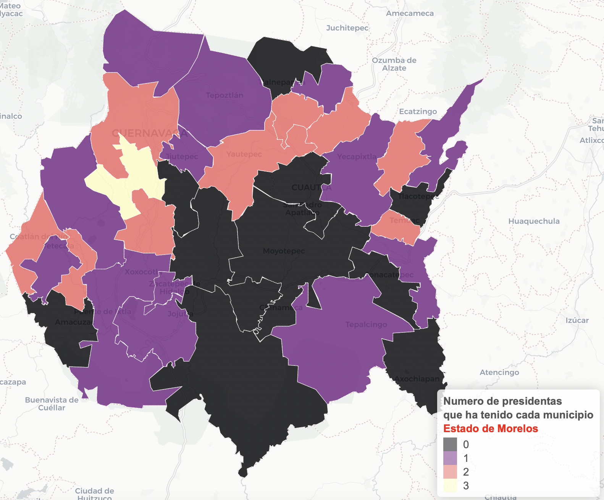

### Día 7. Amarillo. 

[Versión interactiva](https://rpubs.com/Juve_Campos/MapaPlatano2)

<blockquote class="twitter-tweet">
<a href="https://twitter.com/hashtag/30DayMapChallenge?src=hash&amp;ref_src=twsrc%5Etfw">#30DayMapChallenge</a> Dia 8. Amarillo.  Misma idea que el del rojo, solo que ahora para producción de plátano. Tamaño de la esfera proporcional al volumen de producción. Las esferas más grandes son Teapa (Tabasco), Suchiate (Chiapas), Tecoman (Col) y Coahuayana (Mich). <a href="https://twitter.com/hashtag/RStats?src=hash&amp;ref_src=twsrc%5Etfw">#RStats</a> <a href="https://t.co/n4YaQBrAlt">pic.twitter.com/n4YaQBrAlt</a>
&mdash; Juvenal (@JuvenalCamposF) <a href="https://twitter.com/JuvenalCamposF/status/1325698769912909826?ref_src=twsrc%5Etfw">November 9, 2020</a></blockquote> 

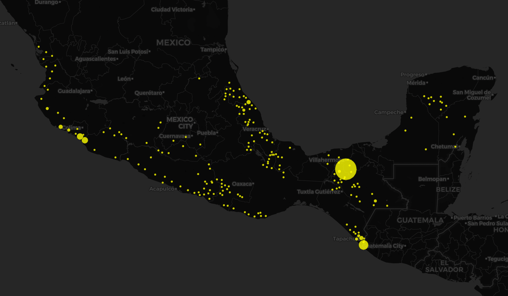

### Día 8. Rojo. 

[Versión interactiva](https://rpubs.com/Juve_Campos/jitomate2019red)

<blockquote class="twitter-tweet">
<a href="https://twitter.com/hashtag/30DayMapChallenge?src=hash&amp;ref_src=twsrc%5Etfw">#30DayMapChallenge</a> Dia 7. Rojo.  Mapa de producción de Jitomate a nivel nacional, para 2019 (año mas reciente). El tamaño de la burbuja está en proporción del volumen de producción (en toneladas). <a href="https://twitter.com/hashtag/RStats?src=hash&amp;ref_src=twsrc%5Etfw">#RStats</a> <a href="https://twitter.com/hashtag/Tomate?src=hash&amp;ref_src=twsrc%5Etfw">#Tomate</a> <a href="https://twitter.com/hashtag/Jitomate?src=hash&amp;ref_src=twsrc%5Etfw">#Jitomate</a> <a href="https://t.co/26uxKtm1Ha">pic.twitter.com/26uxKtm1Ha</a>
&mdash; Juvenal (@JuvenalCamposF) <a href="https://twitter.com/JuvenalCamposF/status/1325683461298876416?ref_src=twsrc%5Etfw">November 9, 2020</a></blockquote> 

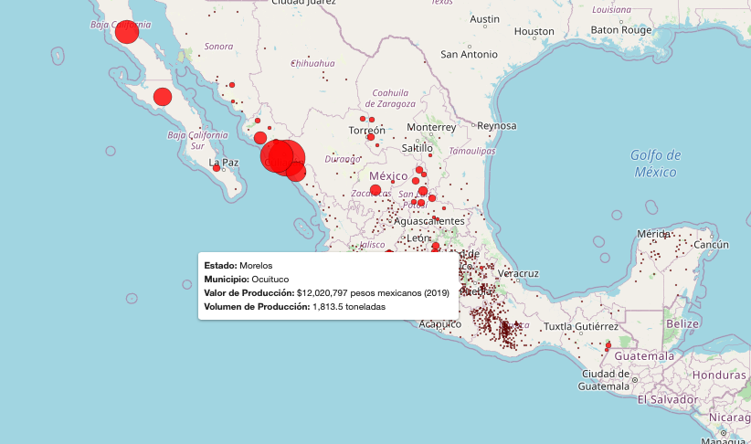

### Día 9. Monocromo. 

<blockquote class="twitter-tweet">
<a href="https://twitter.com/hashtag/30DayMapChallenge?src=hash&amp;ref_src=twsrc%5Etfw">#30DayMapChallenge</a> Dia 9. Monochrome.  Caminos en las Entidades Federativas.  Las venas de los estados. <a href="https://twitter.com/hashtag/Rstats?src=hash&amp;ref_src=twsrc%5Etfw">#Rstats</a> con datos de la Red Nacional de Caminos de <a href="https://twitter.com/INEGI_INFORMA?ref_src=twsrc%5Etfw">@INEGI_INFORMA</a> <a href="https://t.co/OA52ovDsqS">pic.twitter.com/OA52ovDsqS</a>
&mdash; Juvenal (@JuvenalCamposF) <a href="https://twitter.com/JuvenalCamposF/status/1326033028456411136?ref_src=twsrc%5Etfw">November 10, 2020</a></blockquote> 

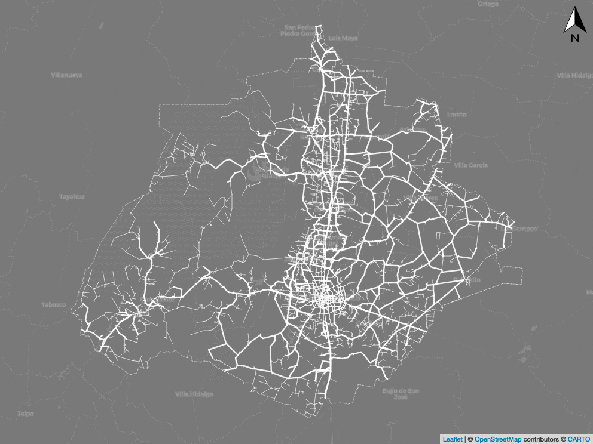

### Día 12. Mapas sin software GIS

<blockquote class="twitter-tweet">
Dia 12 del <a href="https://twitter.com/hashtag/30DayMapChallenge?src=hash&amp;ref_src=twsrc%5Etfw">#30DayMapChallenge</a>  Mapa hecho sin software de GIS Para hoy, dibujé el mapa de <a href="https://twitter.com/hashtag/Morelos?src=hash&amp;ref_src=twsrc%5Etfw">#Morelos</a> en el   <a href="https://twitter.com/hashtag/AnimalCrossing?src=hash&amp;ref_src=twsrc%5Etfw">#AnimalCrossing</a> <a href="https://twitter.com/hashtag/ACNH?src=hash&amp;ref_src=twsrc%5Etfw">#ACNH</a> <a href="https://t.co/cIenW71Ir7">pic.twitter.com/cIenW71Ir7</a>
&mdash; Juvenal (@JuvenalCamposF) <a href="https://twitter.com/JuvenalCamposF/status/1327078203115016192?ref_src=twsrc%5Etfw">November 13, 2020</a></blockquote> 

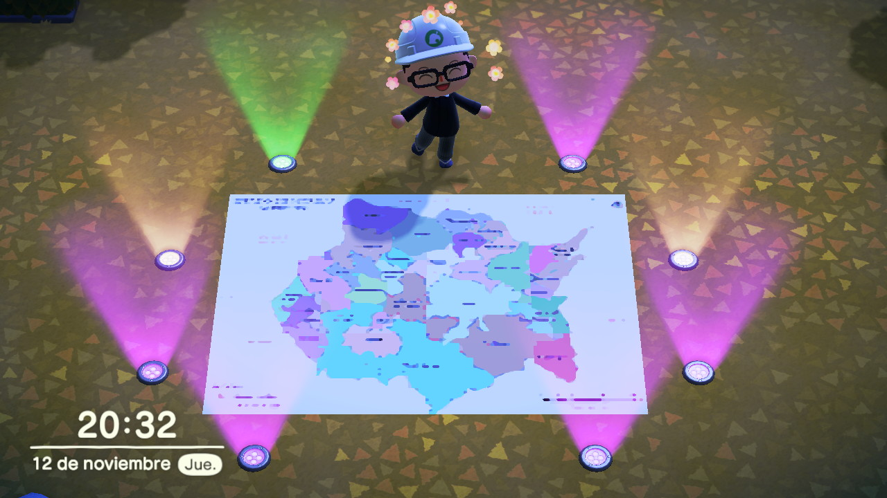

### Día 13. Raster

<blockquote class="twitter-tweet">
<a href="https://twitter.com/hashtag/30DayMapChellenge?src=hash&amp;ref_src=twsrc%5Etfw">#30DayMapChellenge</a> dia 13: Rasters.   Practicando con el Modelo de Elevación Digital de <a href="https://twitter.com/INEGI_INFORMA?ref_src=twsrc%5Etfw">@INEGI_INFORMA</a> para el Estado de Morelos (aprovechando que esta chiquito y cuadrado, porque los datos son pesados y mi compu no es tan poderosa): <a href="https://twitter.com/hashtag/RStats?src=hash&amp;ref_src=twsrc%5Etfw">#RStats</a> <a href="https://twitter.com/hashtag/RSpatial?src=hash&amp;ref_src=twsrc%5Etfw">#RSpatial</a> <a href="https://t.co/EqUWhuWsJ8">pic.twitter.com/EqUWhuWsJ8</a>
&mdash; Juvenal (@JuvenalCamposF) <a href="https://twitter.com/JuvenalCamposF/status/1327447732953309184?ref_src=twsrc%5Etfw">November 14, 2020</a></blockquote> 

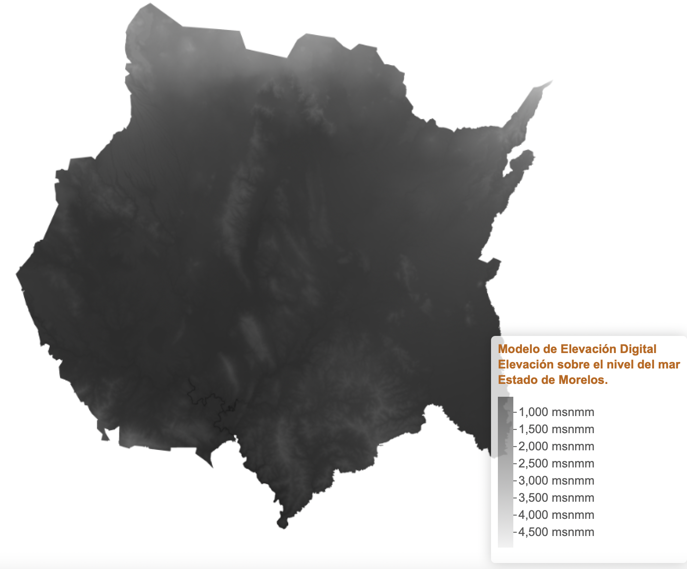

### Día 25. COVID - 19. 

<blockquote class="twitter-tweet">
<a href="https://twitter.com/hashtag/30DayMapChallenge?src=hash&amp;ref_src=twsrc%5Etfw">#30DayMapChallenge</a> Dia 25. Covid19.   En esta ocasión les comparto dos mapas de un mismo fenómeno: los casos de COVID registrados por municipio en el estado de <a href="https://twitter.com/hashtag/Morelos?src=hash&amp;ref_src=twsrc%5Etfw">#Morelos</a> al 25/11 . Uno hecho por mi, y otro por la S Salud del Estado, utilizando una paleta de colores parecida. <a href="https://t.co/7iPK4YyosG">pic.twitter.com/7iPK4YyosG</a>
&mdash; Juvenal (@JuvenalCamposF) <a href="https://twitter.com/JuvenalCamposF/status/1331816648165253121?ref_src=twsrc%5Etfw">November 26, 2020</a></blockquote>

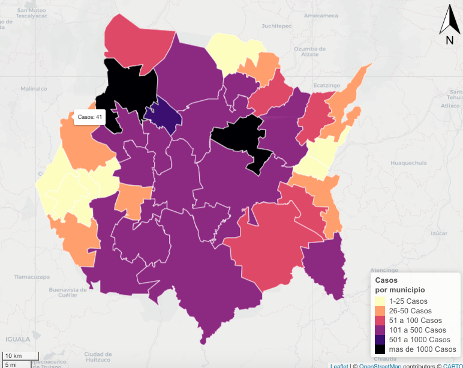

<blockquote class="twitter-tweet">
Una propuesta de mapa que yo propondría (si se desea mostrar una situación menos grave para el estado sin ser tan mañoso) sería uno con escala numérica, como este: <a href="https://t.co/YI85dsZrtH">pic.twitter.com/YI85dsZrtH</a>
&mdash; Juvenal (@JuvenalCamposF) <a href="https://twitter.com/JuvenalCamposF/status/1331819856572928003?ref_src=twsrc%5Etfw">November 26, 2020</a></blockquote> 

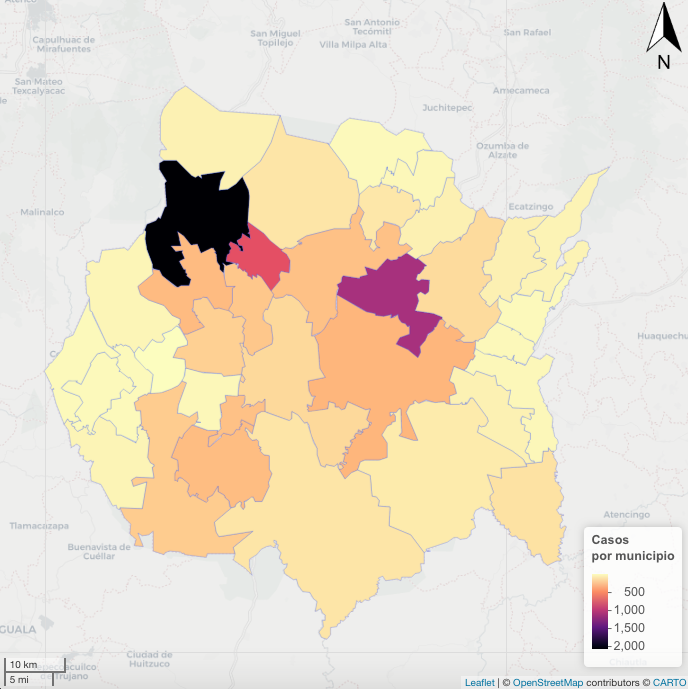

### Día 30. Mapa.

<blockquote class="twitter-tweet">
<a href="https://twitter.com/hashtag/30DayMapChallenge?src=hash&amp;ref_src=twsrc%5Etfw">#30DayMapChallenge</a> Día 30. A map.   Mapa de México en escala viridis con los distintos tiles de la librería leaflet. <a href="https://t.co/P8kkayGU4D">pic.twitter.com/P8kkayGU4D</a>
&mdash; Juvenal (@JuvenalCamposF) <a href="https://twitter.com/JuvenalCamposF/status/1333601635235491840?ref_src=twsrc%5Etfw">December 1, 2020</a></blockquote> 

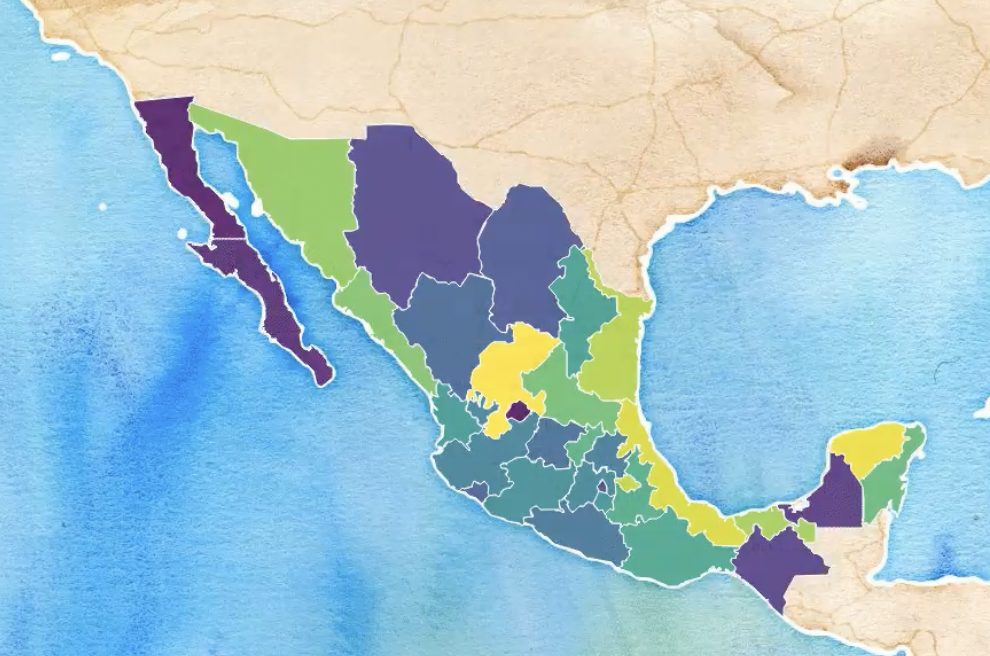

